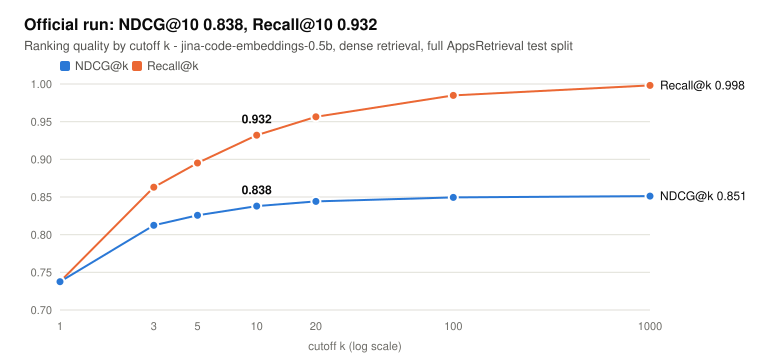
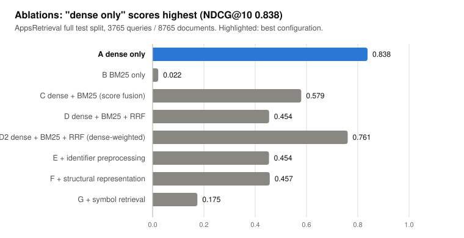
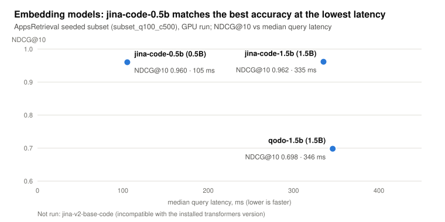
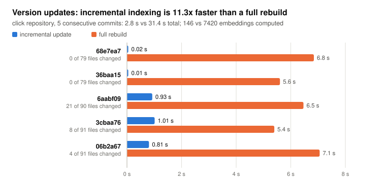
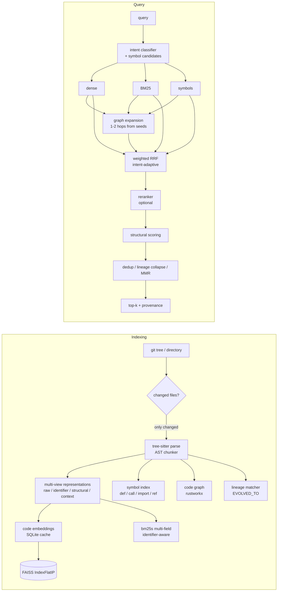
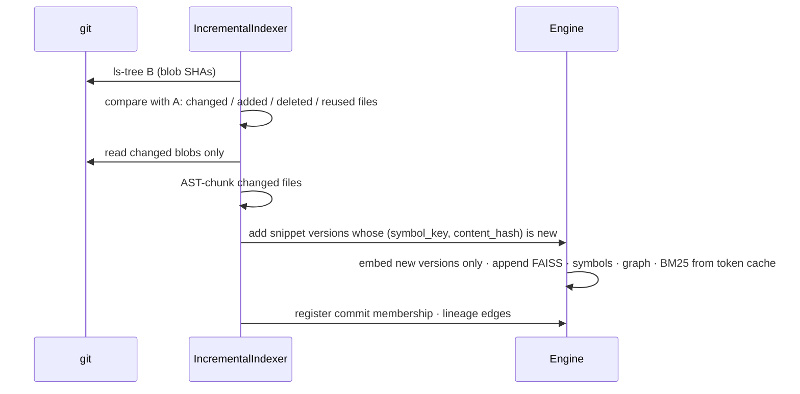

# CodeFusion

**A code-intelligence retrieval engine.** Given a natural-language question about a codebase, CodeFusion returns a ranked list of real code snippets. It does not generate answers.

It parses code into functions, methods, classes and module blocks with tree-sitter. Each snippet is indexed several ways: code embeddings, identifier-aware BM25, a symbol index and a call graph. The rankings are fused per query intent, and every result explains why it was retrieved. Indexes follow git history incrementally, and functions are tracked across commits and renames.

```
$ python scripts/search.py -q "Who calls validate_user?"
Intent: CALLER (confidence 1.0)   scope: latest
#1  main.py:24-29  main  [function]
    retrievers: dense#5, bm25#5, symbol#1, graph#1
    evidence  : symbol:call:validate_user; calls queried symbol validateuser; caller of validate_user
#2  auth.py:42-49  AuthService.validate_user  [method]
    retrievers: dense#3, bm25#6, symbol#2, graph#2
```

## Results at a glance

Every chart is generated from the stored result files by `scripts/make_charts.py`; the exact numbers are in the tables further down.

<picture>
  <source media="(prefers-color-scheme: dark)" srcset="docs/charts/rank_curve-dark.svg">
  
</picture>

**Official result.** The submitted run on the full AppsRetrieval test split. The correct solution is usually the first hit and almost always in the top 10.

<picture>
  <source media="(prefers-color-scheme: dark)" srcset="docs/charts/ablations-dark.svg">
  
</picture>

**Ablations.** Each configuration measured on the full test split. On AppsRetrieval, queries are plain-English problem statements and documents are unrelated competitive-programming solutions, so lexical and symbol signals add noise and dense retrieval alone ranks best. Those components are built for repository questions such as "who calls X?" ([section 10](#10-ablations)).

<picture>
  <source media="(prefers-color-scheme: dark)" srcset="docs/charts/embeddings-dark.svg">
  
</picture>

**Embedding models.** Accuracy against query latency on a seeded subset. The 0.5B model is as accurate as the 1.5B one at about a third of the latency, which is why it is the default.

<picture>
  <source media="(prefers-color-scheme: dark)" srcset="docs/charts/versioning-dark.svg">
  
</picture>

**Retrieval across versions (P1).** Re-indexing a new commit only touches the changed files, so updates take a fraction of a full rebuild ([section 11](#11-version-aware-retrieval-p1)).

---

## Contents

0. [Results at a glance](#results-at-a-glance)
1. [Problem](#1-problem)
2. [Why normal RAG is insufficient](#2-why-normal-rag-is-insufficient)
3. [Architecture](#3-architecture)
4. [Code-aware retrieval approach](#4-code-aware-retrieval-approach)
5. [Installation](#5-installation)
6. [Quick start](#6-quick-start)
7. [Indexing](#7-indexing)
8. [Searching](#8-searching)
9. [Evaluation (AppsRetrieval / MTEB)](#9-evaluation-appsretrieval--mteb)
10. [Ablations](#10-ablations)
11. [Version-aware retrieval (P1)](#11-version-aware-retrieval-p1)
12. [Evolutionary retrieval (bonus)](#12-evolutionary-retrieval-bonus)
13. [API](#13-api)
14. [Frontend](#14-frontend)
15. [Docker](#15-docker)
16. [Optional Neo4j](#16-optional-neo4j)
17. [Optional Joern](#17-optional-joern)
18. [Troubleshooting](#18-troubleshooting)
19. [Repository structure](#19-repository-structure)
20. [Competition submission instructions](#20-competition-submission-instructions)

---

## 1. Problem

Input: a natural-language query ("How is the input preprocessed before going to the main function?") and a potentially large collection of code snippets. Output: those snippets ranked by relevance.

| Priority | Goal | How CodeFusion addresses it |
|---|---|---|
| **P0** | Retrieval accuracy: NDCG@10 and MRR on MTEB **AppsRetrieval** (CoIR) | Official `mteb.evaluate` harness. The P0 configuration is chosen automatically from measured ablations. |
| **P1** | Retrieval across versions | Git-diff-driven incremental indexing. Unchanged snippets are never re-parsed or re-embedded. |
| **Bonus** | Evolutionary retrieval | Lineage tracking (modified, renamed, moved, file renamed), history-aware search, cross-version deduplication. |

The whole system is CPU-first: every number in this repository was measured on a 4-core laptop CPU.

## 2. Why normal RAG is insufficient

A generic "embed chunks, vector DB, LLM" pipeline loses exactly the information code questions depend on:

* **Fixed token windows split functions.** Half of `validate_user` is not retrievable as "the function that validates users". CodeFusion chunks along AST boundaries.
* **Identifiers are not words.** `getUserAuthToken` should match "user auth token", and `MAX_RETRIES` should match "max retries". Generic tokenizers and small embedders miss both. CodeFusion's lexical index splits identifiers and keeps the original.
* **Many code questions are structural.** "Who calls X?", "what does X call?" and "where is X defined?" have exact answers in the call graph and symbol table. Embedding similarity only approximates them: the definition of X looks most similar to "who calls X", yet it is the wrong answer.
* **Code changes.** Re-embedding a whole repository per commit is wasteful. Near-identical versions of a function also flood the top-10 unless they are deduplicated through lineage.

CodeFusion keeps a code-specific embedding model as one strong signal among several: lexical, symbol, graph and version. It fuses them transparently.

## 3. Architecture



Every stage can be switched off from YAML, which is what the ablation runner does. More detail: [docs/architecture.md](docs/architecture.md).

## 4. Code-aware retrieval approach

| Component | Implementation | Module |
|---|---|---|
| Parsing | tree-sitter (Python, JS/TS, Java, Go) through one spec-driven walker; `ast` and regex fallbacks | `parsing/tree_sitter_parser.py`, `parsing/fallback.py` |
| Chunking | Functions, methods, classes and module blocks. Large functions split at top-level statements. Classes become skeletons so method bodies are not indexed twice. | `parsing/chunker.py` |
| Snippet metadata | snippet_id, repository, commit, file, language, type, name, parent, parameters, calls, imports, references, lines, `content_hash`, `ast_hash`, `lineage_id` | `types.py` |
| Representations | raw, identifier, structural (`FUNCTION`/`PARAM`/`CALL`/`ACCESS`/`RETURN`), context (`FILE`/`CLASS`/`CALLS`). Deterministic, no LLM. | `representations/` |
| Tokenization | camelCase, PascalCase, snake_case, SCREAMING_SNAKE, digits and acronyms (`HTTPRequest` → HTTP, Request; `OAuth2Token` → OAuth, OAuth2, Token). The original identifier is kept. | `parsing/identifiers.py` |
| Dense | `EmbeddingProvider` interface with per-model documented prompts. L2-normalized vectors in FAISS `IndexFlatIP` (HNSW/IVF configurable). Persistent embedding cache. | `retrieval/embeddings.py`, `retrieval/dense.py` |
| Lexical | bm25s, one index per view, weighted per-field sum (BM25F-lite), identifier-aware tokenizer | `retrieval/bm25.py` |
| Symbols | Inverted index over normalized symbols with role weights (def > call > import > attr > ref > param), per-intent role multipliers, optional SCIP enrichment | `retrieval/symbols.py`, `parsing/symbols.py` |
| Query intent | Rule-based, 11 classes (DEFINITION, IMPLEMENTATION, USAGE, CALLER, CALLEE, DATA_FLOW, DEPENDENCY, ERROR, CONFIGURATION, EVOLUTION, GENERAL). Microseconds per query. | `query/classifier.py` |
| Fusion | Weighted reciprocal rank fusion `Σ w_i/(k+rank_i)` with configurable `k`. Per-intent weight multipliers. Min-max score fusion kept for ablation. | `retrieval/fusion.py` |
| Reranking | `Reranker` abstraction: cross-encoder (default `Alibaba-NLP/gte-reranker-modernbert-base`) or bi-encoder. Rank-space interpolation. Falls back to the fused ranking if the model is unavailable. | `retrieval/reranker.py` |
| Code graph | rustworkx (NetworkX fallback). Repository, file, snippet, symbol and commit nodes. CONTAINS, DEFINES, CALLS, REFERENCES, IMPORTS, EXTENDS, IMPLEMENTS, OVERRIDES, EVOLVED_TO and IN_COMMIT edges. `callers`, `callees`, `neighbors`, `definitions`, `references`, `imports`, `lineage` APIs. | `graph/` |
| Structural scoring | Transparent boosts: defines, calls or references the queried symbol; caller or callee of top results or of the target; on a short call path; import match | `graph/scoring.py` |
| Diversity | content hash, AST hash, shingle-Jaccard near-duplicates, lineage collapse, optional MMR | `retrieval/diversity.py` |
| Versions | git tree diff, changed files only, append-only temporal store, commit membership masks | `versions/` |

More detail: [docs/retrieval.md](docs/retrieval.md).

### Supported embedding models

| Key | Hugging Face id | Prompts (from the model card) | Notes |
|---|---|---|---|
| `jina-code-0.5b` (**default**) | `jinaai/jina-code-embeddings-0.5b` | nl2code query and document prompts | Qwen2.5-Coder-0.5B, last-token pooling, 896-d |
| `jina-code-1.5b` | `jinaai/jina-code-embeddings-1.5b` | nl2code prompts | 1536-d |
| `qodo-1.5b` | `Qodo/Qodo-Embed-1-1.5B` | none (the model uses no instructions) | gte-Qwen2-1.5B based |
| `jina-v2-base-code` | `jinaai/jina-embeddings-v2-base-code` | none | 161M. Its remote code requires `transformers<5`; with transformers 5 it is reported as NOT RUN. |
| `minilm` | `sentence-transformers/all-MiniLM-L6-v2` | none | General-domain tiny model, used for fast smoke and versioning benchmarks |
| `hashing` | none (no download) | none | Deterministic feature hashing, for tests and CI only |

Any other Hugging Face id works as `dense.model` (no prompts are applied to unregistered models). Why the default is jina-code-0.5b: see [Evaluation](#9-evaluation-appsretrieval--mteb).

## 5. Installation

Requires Python 3.11 (3.10+ works) and git. Node 18+ is needed only to build the UI.

```bash
git clone https://github.com/abhasbali/samsung-hackathon.git codefusion && cd codefusion
python -m venv .venv
source .venv/bin/activate            # Windows: .venv\Scripts\activate
pip install torch --index-url https://download.pytorch.org/whl/cpu   # CPU wheel, no CUDA
pip install -r requirements.txt
```

No API key, GPU, Neo4j, Joern or external service is needed. The embedding model (about 1 GB for jina-code-0.5b) downloads from the Hugging Face Hub on first use.

## 6. Quick start

```bash
python scripts/index_repo.py examples/sample_repo
python scripts/search.py --query "How is input validated before processing?"
python scripts/search.py -q "Who calls validate_user?" -q "Where is MAX_RETRIES configured?" --top-k 3
```

Without network access, add `--config configs/test_tiny.yaml` to both commands. That config uses the download-free hashing embedder, so results are weaker but the full pipeline still runs.

## 7. Indexing

```bash
python scripts/index_repo.py path/to/repo                    # git repo: indexes HEAD; directory: working tree
python scripts/index_repo.py path/to/repo --history          # every first-parent commit, incrementally
python scripts/index_repo.py path/to/repo --config configs/cpu_fast.yaml --set dense.batch_size=8
```

Indexes are saved under `artifacts/index/`: SQLite for snippet versions, commits and lineage, `vectors.npy`, and `snippets.parquet`. Re-running on a new commit indexes only the difference (see [section 11](#11-version-aware-retrieval-p1)).

## 8. Searching

```bash
python scripts/search.py -q "What functions are called before the user is saved?"
python scripts/search.py -q "How did authentication change between versions?" --version all
python scripts/search.py -q "..." --version 3f2a1c    # a specific commit (sha prefix)
python scripts/search.py -q "..." --json              # full provenance and per-stage timings
```

Each result carries its dense, BM25, symbol and graph ranks, RRF contributions, reranker score, structural boost, graph evidence, and timings for every stage (preprocess, dense, bm25, symbol, graph, fusion, rerank, structural, diversity).

## 9. Evaluation (AppsRetrieval / MTEB)

```bash
# Official submission file: mteb.get_task("AppsRetrieval"), organisers' AbsEncoder path
python evaluate.py --config configs/baseline_dense.yaml --mode dense --output appsretrieval_results.json

# The full CodeFusion pipeline evaluated by MTEB through its SearchProtocol (hybrid retrieval)
python evaluate.py --config configs/p0_apps.yaml --output artifacts/eval/appsretrieval_p0.json

# Smoke test on a seeded subsample (written as *_subset_*, never the official file)
python evaluate.py --config configs/baseline_dense.yaml --max-queries 50 --max-corpus 500
```

Both modes write MTEB's own `TaskResult` JSON, plus a `*_summary.json` with NDCG@10, MRR@10, recall, indexing time, query latency (P50/P95), peak memory and the enabled components. The dense and hybrid paths share one embedding cache and encode identical texts (verified), so the corpus is encoded only once across all runs.

<!-- RESULTS:OFFICIAL:START -->
| Result file | Mode | Configuration | Model | NDCG@10 | MRR@10 | Recall@100 | Queries / docs | Device | Wall time | Peak RAM |
|---|---|---|---|---|---|---|---|---|---|---|
| `artifacts/eval/appsretrieval_p0.json` | dense | p0_apps | jina-code-0.5b | **0.8379** | **0.8074** | 0.9849 | 3765 / 8765 | cuda | 0.6 min | 3909 MB |
| `artifacts/eval/appsretrieval_results.json` | dense | baseline_dense | jina-code-0.5b | **0.8379** | **0.8074** | 0.9849 | 3765 / 8765 | cuda | 12.7 min | 4029 MB |

Full AppsRetrieval test split. The baseline run resumed its embedding cache across devices (partial CPU run, completed on a GPU); later runs reuse that cache, hence their short wall times. MTEB's own JSON is the result file; the table is generated from its summary.
<!-- RESULTS:OFFICIAL:END -->

### Embedding models

```bash
python scripts/benchmark_embeddings.py                                  # seeded subset, all four candidates
python scripts/benchmark_embeddings.py --models jina-code-0.5b --full   # full test split
```

<!-- RESULTS:EMBEDDINGS:START -->
### Embedding models on AppsRetrieval (subset_q100_c500)

| Model | Params | NDCG@10 | MRR@10 | P50 query ms | P95 query ms | Index s | docs/s | RAM Δ MB | Peak VRAM MB | Status |
|---|---|---|---|---|---|---|---|---|---|---|
| jina-code-0.5b | 0.5B | 0.9602 | 0.9500 | 105.2 | 288.0 | 0.0 | n/a | 1074 | 2073 | ok |
| jina-v2-base-code | 161M | n/a | n/a | n/a | n/a | n/a | n/a | n/a | n/a | NOT RUN: embedding model 'jinaai/jina-embeddings-v2-base-code' unavailable: ImportError: cannot import name 'find_pruneable_heads_and_indices' from 'transformers.pytorch_utils' (/usr/local/lib/python3.13/dist-packages/transformers/pytorch_utils.py) |
| jina-code-1.5b | 1.5B | 0.9616 | 0.9517 | 335.1 | 769.6 | 92.9 | 4.28 | 637 | 8878 | ok |
| qodo-1.5b | 1.5B | 0.6980 | 0.6500 | 345.9 | 783.4 | 97.5 | 4.14 | n/a | 8875 | ok |

RAM Δ is the process RSS change while loading the model (n/a when negative: the previous model's memory was released). On GPU runs the weights live in VRAM, so Peak VRAM is the meaningful footprint. Index s / docs/s are 0 / n/a when every embedding came from the shared cache.
<!-- RESULTS:EMBEDDINGS:END -->

## 10. Ablations

```bash
python scripts/run_ablations.py --list                      # the A–N matrix and exact overrides
python scripts/run_ablations.py --config configs/full.yaml  # full test split
python scripts/run_ablations.py --max-queries 300 --max-corpus 3000 --only A D G H
python scripts/select_p0_config.py                          # writes configs/p0_apps.yaml from the results
```

Each experiment adds one component to the previous row: A dense, B BM25, C score fusion, D RRF, D2 dense-weighted RRF, E identifier splitting, F structural views, G symbols, H reranker, I graph, J query-adaptive weights, K full system, L MMR, M late interaction, N Joern. **The P0 configuration is whichever row scores best, not a hand-picked one.** Components that do not help AppsRetrieval stay available for repository search, P1 and the demo, but they are off in `configs/p0_apps.yaml`.

<!-- RESULTS:ABLATIONS:START -->
### AppsRetrieval ablations (full)

| Exp | Configuration | NDCG@10 | MRR@10 | P50 ms | P95 ms | Index s | Status |
|---|---|---|---|---|---|---|---|
| A | dense only | 0.8380 | 0.8076 | 2.9 | 4.3 | 17.0 | ok |
| B | BM25 only | 0.0220 | 0.0169 | 1.5 | 2.0 | 20.0 | ok |
| C | dense + BM25 (score fusion) | 0.5794 | 0.4637 | 3.9 | 6.0 | 16.6 | ok |
| D | dense + BM25 + RRF | 0.4542 | 0.3209 | 3.8 | 5.9 | 16.6 | ok |
| D2 | dense + BM25 + RRF (dense-weighted) | 0.7606 | 0.7043 | 3.8 | 6.0 | 17.1 | ok |
| E | + identifier preprocessing | 0.4538 | 0.3238 | 3.9 | 6.0 | 18.8 | ok |
| F | + structural representation | 0.4567 | 0.3267 | 4.6 | 7.5 | 19.7 | ok |
| G | + symbol retrieval | 0.1746 | 0.1243 | 6.0 | 16.2 | 19.2 | ok |

Latency is per-query engine search time; batched query embedding is excluded and reported in the JSON.

### AppsRetrieval ablations (subset_q300_c3000)

| Exp | Configuration | NDCG@10 | MRR@10 | P50 ms | P95 ms | Index s | Status |
|---|---|---|---|---|---|---|---|
| A | dense only | 0.8982 | 0.8737 | 2.6 | 3.9 | 6.9 | ok |
| D | dense + BM25 + RRF | 0.4236 | 0.2871 | 2.6 | 3.4 | 7.8 | ok |
| G | + symbol retrieval | 0.1615 | 0.1395 | 3.8 | 6.3 | 8.0 | ok |
| H | + reranker | 0.3287 | 0.2463 | 2502.3 | 2970.8 | 15.5 | ok |

Latency is per-query engine search time; batched query embedding is excluded and reported in the JSON.

**Not evaluated on the full split:** I (+ code graph); J (+ query-adaptive weighting); K (full system); L (+ diversity/MMR); M (+ late interaction); N (+ Joern / CPG).
<!-- RESULTS:ABLATIONS:END -->

`scripts/run_experiment_suite.py` reproduces every stored result in order: official, ablations, reranker, p0, embeddings, versioning. It is resumable.

## 11. Version-aware retrieval (P1)



The store is append-only and temporal: each distinct snippet version is stored once, together with the commits it appears in. One set of indexes therefore answers "latest", "at commit X" and "all versions". The tests assert that unchanged snippets are not re-embedded (`tests/test_versions.py`).

```bash
python scripts/benchmark_versions.py                                    # demo history
python scripts/benchmark_versions.py --repo path/to/git/repo --commits 8 --config configs/full.yaml
```

<!-- RESULTS:VERSIONING:START -->
### Incremental vs full rebuild: click (minilm)

| Commit | Files changed/added/deleted | Live snippets | Incremental s | Full rebuild s | Speed-up | Embeddings (inc / full) |
|---|---|---|---|---|---|---|
| 68e7ea7228 | 0/0/0 of 79 | 1471 | 0.017 | 6.846 | 412.58x | 0 / 1452 |
| 36baa15ff8 | 0/0/0 of 79 | 1471 | 0.012 | 5.604 | 483.23x | 0 / 1452 |
| 6aabf099bf | 8/12/1 of 90 | 1512 | 0.926 | 6.466 | 6.98x | 66 / 1486 |
| 3cbaa76b60 | 7/1/0 of 91 | 1520 | 1.014 | 5.397 | 5.32x | 28 / 1494 |
| 06b2a67874 | 4/0/0 of 91 | 1562 | 0.806 | 7.058 | 8.76x | 52 / 1536 |

Total: incremental 2.77s vs full 31.37s (11.3x); embeddings computed 146 vs 7420.

### Incremental vs full rebuild: demo_history_repo (hashing)

| Commit | Files changed/added/deleted | Live snippets | Incremental s | Full rebuild s | Speed-up | Embeddings (inc / full) |
|---|---|---|---|---|---|---|
| 38945a955e | 4/2/1 of 7 | 28 | 0.488 | 0.646 | 1.32x | 23 / 28 |
| 000d70b375 | 6/0/0 of 7 | 34 | 0.410 | 0.591 | 1.44x | 15 / 34 |

Total: incremental 0.90s vs full 1.24s (1.38x); embeddings computed 38 vs 62.
<!-- RESULTS:VERSIONING:END -->

More detail: [docs/versioning.md](docs/versioning.md).

## 12. Evolutionary retrieval (bonus)

Lineage is matched by a cascade:

1. Same symbol key: *modified*.
2. Same name in a file git reports as renamed: *file_renamed*.
3. Identical content or AST hash elsewhere: *moved*.
4. Same kind and high similarity: *renamed* or *evolved*.

Every version inherits its predecessor's `lineage_id`, which produces chains like `authenticate@v1 → authenticate@v2 → validate_user@v3`.

* The EVOLUTION intent ("How did authentication change between versions?") searches all versions, keeps several versions of each lineage, orders them oldest first and returns the lineage chain.
* Any other query collapses each lineage to its best version, so near-identical history never floods the top-10.

```bash
python scripts/make_demo_history.py                      # real 3-commit git repo from examples/
python scripts/index_repo.py artifacts/demo_history_repo --history --index-dir artifacts/index_history
python scripts/search.py --index-dir artifacts/index_history -q "How did authentication change between versions?"
```

## 13. API

```bash
uvicorn codefusion.api.main:app --port 8000     # after: pip install -e .   (or set PYTHONPATH=src)
```

| Method | Path | Purpose |
|---|---|---|
| GET | `/health` | status, snippet count |
| POST | `/index/repository` | `{"path": "...", "history": false}` |
| POST | `/search` | `{"query": "...", "top_k": 10, "version": null}` |
| POST | `/search/explain` | same, plus weights, query analysis and dropped duplicates |
| GET | `/stats` | index statistics |
| POST | `/versions/index` | index one commit (`rev`) or the full history of a git repo |
| GET | `/versions/{repo}` | indexed commits and lineage relation counts |
| GET | `/snippets/{id}/lineage` | the version chain of a snippet |
| GET | `/graph/callchain?snippet_id=` | callers and callees for the visualisation |
| GET | `/experiments` | stored, measured results only |

Search responses contain the rank, snippet, file, lines, symbol, language, commit, final score, per-retriever contributions, structural and graph evidence, and per-stage latency. Environment variables: `CODEFUSION_CONFIG`, `CODEFUSION_INDEX_DIR`, `CODEFUSION_ALLOW_FALLBACK`.

## 14. Frontend

```bash
cd frontend && npm install
npm run dev          # http://localhost:5173, proxies to the API on :8000
npm run build        # dist/ is served by the API at http://localhost:8000/
```

* **Search:** the query, detected intent and target symbols, total and per-stage timing, the status of every retriever with its hit count and intent weight, the candidate funnel (retrieved → fused → reranked → top-k), and results with highlighted code. Each result has a "Why retrieved" panel (dense, BM25, symbol and graph ranks, RRF contributions, structural boosts, evidence), its lineage and an on-demand call chain (`main() ↓ preprocess() ↓ …`).
* **Experiments:** reads `/experiments`, so it shows only stored measured results. Missing experiments show *Not evaluated*.
* **Index & versions:** index a path, see per-commit reuse statistics, the commit timeline and lineage relations.

See [docs/demo.md](docs/demo.md) for the demo script.

## 15. Docker

```bash
docker compose up --build            # API + UI on http://localhost:8000; indexes the sample repo on first start
docker build -t codefusion . && docker run -p 8000:8000 codefusion
```

The image is CPU-only (PyTorch CPU wheel). Model downloads persist in the `hf-cache` volume.

## 16. Optional Neo4j

The graph lives in memory (rustworkx). Neo4j is used only for visualization and is never needed for search or evaluation.

```bash
docker compose --profile neo4j up -d neo4j && pip install neo4j
python scripts/export_neo4j.py --index-dir artifacts/index
# http://localhost:7474 :  MATCH p=(:CFNode)-[:REL {type: 'EVOLVED_TO'}]->(:CFNode) RETURN p LIMIT 50
```

## 17. Optional Joern

This is an experimental Code Property Graph enrichment. It adds CALLS edges that Joern resolved and the AST pass missed, plus parameter-to-call data-flow evidence. It needs Joern on `PATH` (Java 17+). Without Joern, every entry point exits cleanly and ablation N is reported as NOT RUN. It is not claimed to improve anything until measured.

```bash
python scripts/joern_enrich.py examples/sample_repo --index-dir artifacts/index
```

The late-interaction (ColBERT-style MaxSim) module is in `experimental/late_interaction.py`; see [docs/evaluation.md](docs/evaluation.md#experimental-modules).

## 18. Troubleshooting

| Symptom | Fix |
|---|---|
| `ProviderUnavailable: embedding model ... unavailable` | No network or Hub access. Use `--allow-fallback` (hashing embeddings) or `--config configs/test_tiny.yaml`, or pre-download the model. |
| `jina-v2-base-code` / `jina-reranker-v2` fail with `ImportError` | Their remote code targets transformers 4.x. Use the defaults, or `pip install "transformers<5"` in a separate environment. |
| Encoding is slow on CPU | Set `dense.torch_threads` to the number of **physical** cores (hyper-threads slowed encoding about 2.8× in our probe). Try `configs/cpu_fast.yaml` or `--set dense.max_seq_length=512`. int8 dynamic quantization is available but measured harmful for Qwen-based embedders. |
| An interrupted evaluation | Just re-run it. Embeddings are committed to `artifacts/cache/embeddings.sqlite` every 256 texts, and completed work is reused. |
| `409 index is empty` from the API | Run `POST /index/repository` or `python scripts/index_repo.py ...` first. |
| Windows symlink warning from huggingface_hub | Harmless. Set `HF_HUB_DISABLE_SYMLINKS_WARNING=1`. |

## 19. Repository structure

```
codefusion/
├── src/codefusion/
│   ├── parsing/          tree_sitter_parser, chunker, identifiers, symbols, fallback
│   ├── representations/  raw, identifier, structural, context views
│   ├── retrieval/        embeddings, dense (FAISS), bm25, symbols, fusion, reranker, diversity, pipeline
│   ├── query/            classifier, preprocess, expansion
│   ├── graph/            store (rustworkx/NetworkX), builder, scoring, neo4j_adapter
│   ├── versions/         git_tracker, incremental, lineage, demo_history, benchmark
│   ├── experimental/     joern, late_interaction
│   ├── evaluation/       mteb_encoder, official, metrics, ablation, benchmark, tracking (MLflow)
│   ├── storage/          sqlite, artifacts (Parquet)
│   ├── config/           typed schema + YAML loader (extends, dotted overrides)
│   └── api/main.py       FastAPI
├── frontend/             React + Vite + TypeScript
├── configs/              baseline_dense, hybrid, full, cpu_fast, experimental_cpg, test_tiny, p0_apps (generated)
├── scripts/              index_repo, search, evaluate_mteb, run_ablations, benchmark_embeddings,
│                         benchmark_versions, select_p0_config, run_experiment_suite, make_demo_history,
│                         export_neo4j, joern_enrich
├── tests/                pytest (tokenizer, chunker, symbols, BM25, FAISS, RRF, classifier, graph,
│                         dedup, version diff, incremental indexing, lineage, API, MTEB wrapper, ...)
├── examples/             sample_repo (+ sample_repo_history v1/v2), demo_queries.json
├── artifacts/            measured results: eval/, ablations/, benchmarks/
├── docs/                 architecture, retrieval, versioning, evaluation, demo
├── evaluate.py           official AppsRetrieval entry point
├── Dockerfile, docker-compose.yml, .github/workflows/ci.yml
└── pyproject.toml, requirements.txt, .env.example, LICENSE
```

## 20. Competition submission instructions

1. Install (see [section 5](#5-installation)).
2. Produce the official result file:
   ```bash
   python evaluate.py --config configs/baseline_dense.yaml --mode dense --output appsretrieval_results.json
   ```
   This is the organisers' `AbsEncoder` path: `mteb.get_task("AppsRetrieval")`, `mteb.evaluate`, and `TaskResult.to_disk`. The hybrid P0 pipeline has its own official-format file: `python evaluate.py --config configs/p0_apps.yaml --output appsretrieval_results_p0.json`.
3. Submit `appsretrieval_results.json`, or the P0 file if it scores higher. Both are produced by MTEB itself; nothing is post-processed.
4. Reproduce every table in this README with `python scripts/run_experiment_suite.py`.

**Submitted file:** `artifacts/eval/appsretrieval_results.json` (NDCG@10 0.8379, MRR@10 0.8074 on the full test split), attached to the GitHub Release tagged `PRISM_GENAI_HACKATHON_Y2026`.

**Hardware.** Everything runs on CPU, which is the default (`device: cpu` in every config). To save time, the stored AppsRetrieval embeddings were finished on a Colab T4 GPU: the official run encoded its first 2,048 queries on a 4-core laptop CPU, then resumed from the same embedding cache on the GPU. The model, weights, precision (float32) and prompts are identical, so the result is the one a CPU run produces, only faster. To use a GPU yourself, set `CODEFUSION_DEVICE=cuda`. Each summary JSON records the device it ran on. Subset runs are always labelled `subset`; unrun experiments are labelled *Not evaluated* or *NOT RUN* with the reason.

## License

MIT
