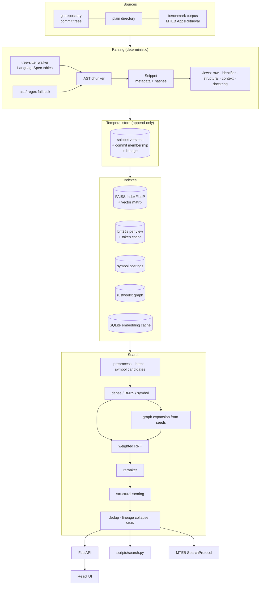

# Architecture

CodeFusion is a retrieval engine, not a RAG application. Its output is a ranked list of snippets with provenance. The system is organised as independent, individually switchable stages around one **temporal snippet store**.



## Components and their contracts

| Layer | Contract | Why it matters |
|---|---|---|
| `parsing.tree_sitter_parser` | `analyze(source) -> ParsedFile(units, file_info)` with definitions, calls, imports, parameters, attribute accesses, identifiers, returns, raises, decorators, bases, docstrings | One walker for every language. A new language is a `LanguageSpec` data entry, not code. |
| `parsing.chunker` | `chunk_source(text, path) -> list[Snippet]`; `analyze_document(text, id) -> Snippet` for whole benchmark documents | Semantic units instead of token windows. Stable `symbol_key`, `content_hash` and `ast_hash` drive incremental indexing and deduplication. |
| `representations` | `build_views(snippet) -> {raw, identifiers, structural, context, docstring}` | The views are stored separately so experiments can decide which ones help (ablation F). |
| `retrieval.embeddings` | `EmbeddingProvider.encode_queries / encode_documents`; `CachedEmbedder` | Model-specific prompts. The cache keys on `sha1(model fingerprint, prompt, text)`, so any unchanged text is never re-encoded, whether across ablations, restarts or commits. |
| `retrieval.dense` | `VectorIndex(flat / hnsw / ivf)`, masked exact search for version scopes | Cosine similarity through inner product on L2-normalized vectors. |
| `retrieval.bm25` | Multi-field bm25s with a per-view weight | Tokens are cached per `content_hash`, so an incremental rebuild only re-tokenizes changed snippets. |
| `retrieval.symbols` | Postings `normalized_symbol -> [(snippet, role)]` | Exact matching across naming conventions: `validateUser` == `validate_user`. |
| `graph.store` / `graph.builder` | rustworkx `PyDiGraph` keyed by strings; `callers`, `callees`, `neighbors`, `definitions`, `references`, `imports`, `lineage`, `call_chain`, `shortest_call_path` | Calls resolve through symbol nodes, so appending new snippets links them to existing call sites without rebuilding. |
| `retrieval.fusion` | `fuse(cfg, ranked_lists, intent) -> candidates` | Rank-based and scale-free. Intent-adaptive weights come from configuration. |
| `retrieval.reranker` | `Reranker.score(query, docs)`; `combine_rerank` in rank space | Optional. It degrades to the fused order if the model cannot load. |
| `graph.scoring` | `GraphRetriever.search(pq, seeds, mask)`; `StructuralScorer.apply(pq, pool, ...)` | Seeded 1–2 hop expansion, never whole-graph scans. Every boost records a human-readable evidence string. |
| `retrieval.diversity` | `deduplicate(...) -> (kept, dropped with reason)`; `mmr(...)` | Keeps the top-k informative. Near-identical historical versions are collapsed unless the query asks about history. |
| `versions.incremental` | `IncrementalIndexer.index_commit / index_history / index_worktree -> UpdateStats` | P1. Git tree diffs decide what to parse and embed. |
| `versions.lineage` | `LineageMatcher.match(old, new, renames) -> edges` | Bonus. Tracks functions across modifications, renames and moves. |
| `evaluation.*` | MTEB `AbsEncoder` and `SearchProtocol` wrappers, ablation runner, embedding benchmark, metrics | P0 measurement that is reproducible and honest. |

## The temporal snippet store

Each distinct `(symbol_key, content_hash)` is stored **once**, with the list of commits it appears in:

```
snippets[i]  = Snippet(... commit=<first commit>, commits=[A, B, C], lineage_id=L42)
members[sha] = sorted snippet indices alive at that commit
latest[repo] = sha
lineage      = [(old_idx, new_idx, relation, similarity), ...]
```

Every index (FAISS, BM25, symbols, graph) is append-only over this store. A version scope becomes a boolean mask:

| scope | mask |
|---|---|
| `latest` (default) | members of each repository's latest commit, plus snippets not tied to any commit |
| `<sha>` or prefix | members of that commit |
| `all` / EVOLUTION intent | no mask. Every version is eligible and diversity collapses lineages unless the intent is EVOLUTION. |

Masked dense search is an exact NumPy matmul over the live subset, so results are identical to rebuilding a per-commit index.

## Persistence

| File | Content |
|---|---|
| `artifacts/index/index.db` | SQLite: snippets (all metadata as JSON), commits, membership, lineage, config and model fingerprint |
| `artifacts/index/vectors.npy` | Dense matrix, reused on load when the model fingerprint matches |
| `artifacts/index/snippets.parquet` | Analysis-friendly export (pandas/pyarrow) |
| `artifacts/cache/embeddings.sqlite` | Embedding cache shared by indexing, evaluation, ablations and benchmarks |

## Configuration

`configs/*.yaml` are validated by a Pydantic schema (`config/schema.py`, `extra="forbid"`, so typos fail loudly). Files can `extends:` another config, and every CLI accepts `--set section.key=value` overrides. The main configs:

| Config | Purpose |
|---|---|
| `baseline_dense.yaml` | Experiment A: dense only (the official AbsEncoder path) |
| `hybrid.yaml` | Dense + BM25 + symbols, RRF |
| `full.yaml` | Every component: repository search, demo, P1 and bonus |
| `cpu_fast.yaml` | Smaller model and shorter sequences |
| `experimental_cpg.yaml` | 2-hop graph + MMR, the companion config for the Joern and late-interaction experiments |
| `test_tiny.yaml` | Hashing embeddings, no downloads (tests and CI) |
| `p0_apps.yaml` | **Generated** by `scripts/select_p0_config.py` from the measured ablations |

## Optional parts

Neo4j, Joern, SCIP, MLflow, late interaction and rerankers are imported lazily. A missing dependency, binary or model produces a logged warning and a `NOT RUN` / `unavailable` status, never an import error in the core path. CI checks that the core imports without them.
